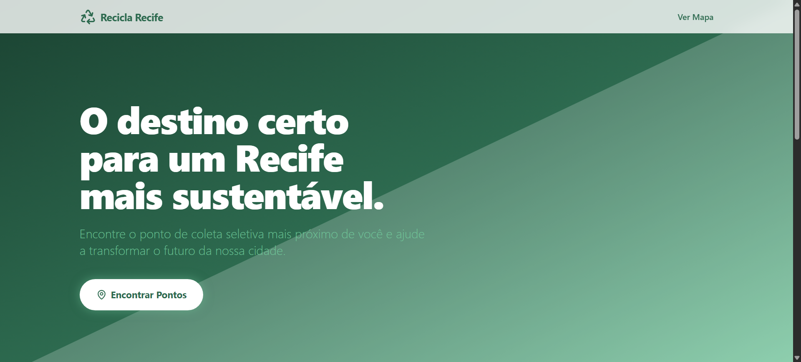
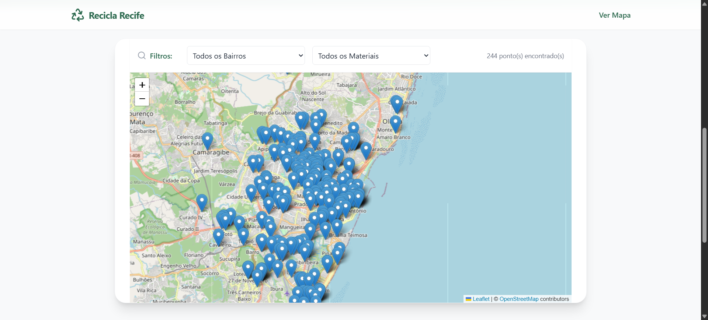

# ♻️ Recicla Recife

<p align="center">
  
</p>

> **O destino certo para um Recife mais sustentável.** 🌍

O **Recicla Recife** é uma plataforma interativa de utilidade pública desenvolvida para facilitar o descarte correto de resíduos sólidos. Através de um mapa dinâmico alimentado por dados oficiais da Prefeitura do Recife, os usuários podem encontrar pontos de coleta seletiva de forma rápida e eficiente.

---

## 📸 Demonstração

O projeto conta com uma interface limpa, moderna e focado na facilidade de uso:

<p align="center">
  
  <em>Visualização do mapa interativo com suporte a filtros por bairro e tipo de material.</em>
</p>

---

## 🚀 Funcionalidades

- 📍 **Mapa Interativo:** Localização em tempo real de centenas de pontos de coleta utilizando Leaflet.
- 🔍 **Filtros por Bairro:** Encontre o ecoponto mais próximo da sua residência.
- ♻️ **Filtro por Material:** Saiba onde descartar papel, vidro, metal, eletrônicos, pneus e óleo de cozinha.
- 📊 **Integração em Tempo Real:** Consumo da API oficial do Portal de Dados Abertos da Cidade do Recife.

---

## 🛠️ Tecnologias Utilizadas

Este projeto foi construído com ferramentas modernas do ecossistema Web:

- **React.js & Vite:** Para um desenvolvimento ágil e performance superior.
- **Tailwind CSS:** Estilização premium e totalmente responsiva.
- **React Leaflet:** Integração robusta com mapas baseados em OpenStreetMap.
- **Lucide Icons:** Ícones modernos e minimalistas.

---

## 🎓 Atividade Prática Interdisciplinar de Extensão I (APIE I)

Este projeto foi desenvolvido como parte integrante das atividades de extensão universitária:

- **Curso:** Tecnologia da Informação
- **Instituição:** UNINASSAU (Centro Universitário Maurício de Nassau)
- **Orientadora:** Profa. Tereza Carla Souza Pereira
- **Desenvolvedor:** Matheus Rodrigues Tomaz

---

## 📦 Instalação e Uso Local

1. **Clone o repositório:**
   ```bash
   git clone https://github.com/matheusrtomaz/recicla-recife.git
   ```

2. **Instale as dependências:**
   ```bash
   npm install
   ```

3. **Inicie o servidor de desenvolvimento:**
   ```bash
   npm run dev
   ```

---

## 🔗 Fonte de Dados

Utilizamos o **Portal de Dados Abertos da Cidade do Recife**, especificamente o dataset de Pontos de Coleta Seletiva, garantindo que as informações apresentadas sejam oficiais e atualizadas. 🏛️

---

<p align="center">
  Desenvolvido com 💚 por <a href="https://github.com/matheusrtomaz">Matheus Rodrigues Tomaz</a>
</p>
